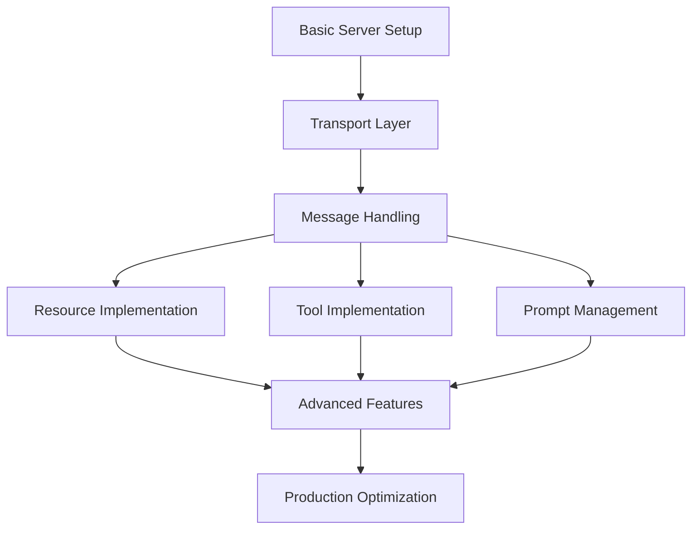

# MCP Implementation Guide

This guide is organized to support the practical implementation of MCP servers, focusing on progressive development patterns and component relationships.

## Implementation Roadmap



## Core Components and Dependencies

| Component            | Depends On       | Implementation Files                   | Concepts                    |
| -------------------- | ---------------- | -------------------------------------- | --------------------------- |
| Server Core          | -                | `specification/server/_index.md`       | `concepts/architecture.mdx` |
| Transports           | Server Core      | `specification/basic/transports.md`    | `concepts/transports.mdx`   |
| Message Handling     | Transports       | `specification/basic/messages.md`      | -                           |
| Resources            | Message Handling | `specification/server/resources.md`    | `concepts/resources.mdx`    |
| Tools                | Message Handling | `specification/server/tools.md`        | `concepts/tools.mdx`        |
| Prompts              | Message Handling | `specification/server/prompts.md`      | `concepts/prompts.mdx`      |
| Authorization        | Transports       | `specification/basic/authorization.md` | -                           |
| Lifecycle Management | Message Handling | `specification/basic/lifecycle.md`     | -                           |

## Implementation Stages

### 1. Minimal Viable Server

Start with a basic functional server that can establish connections and handle simple messages.

**Key Files:**
- `specification/server/_index.md` - Server foundation
- `specification/basic/transports.md` - Communication layer
- `concepts/architecture.mdx` - Overall architecture

**Implementation Pattern:**
```python
from mcp.server import Server
from mcp.server.stdio import stdio_server

async def main():
    server = Server()
    
    # Register minimal handlers
    @server.on_initialize
    async def handle_initialize(params):
        return {"capabilities": {}}
        
    # Start the server with a transport
    await stdio_server(server)

if __name__ == "__main__":
    import asyncio
    asyncio.run(main())
```

### 2. Adding Resources

Resources allow your server to expose data that can be read by clients.

**Key Files:**
- `specification/server/resources.md` - Resource implementation details
- `concepts/resources.mdx` - Resource concepts and patterns

**Implementation Pattern:**
```python
# Register resource provider
@server.resource_provider("file")
async def provide_file(uri, params):
    # Parse the URI to get file path
    path = uri.path
    try:
        with open(path, "r") as f:
            content = f.read()
        return {"content": content, "contentType": "text/plain"}
    except Exception as e:
        return {"error": str(e)}
```

### 3. Implementing Tools

Tools allow clients to perform actions through your server.

**Key Files:**
- `specification/server/tools.md` - Tool implementation details
- `concepts/tools.mdx` - Tool concepts and patterns

**Implementation Pattern:**
```python
# Register a tool
@server.tool("search_files")
async def search_files(params):
    query = params.get("query", "")
    # Implement search logic
    results = [...] # Search results
    return {"results": results}
```

### 4. Managing Prompts

Provide templated prompts to clients.

**Key Files:**
- `specification/server/prompts.md` - Prompt implementation
- `concepts/prompts.mdx` - Prompt concepts

**Implementation Pattern:**
```python
# Register prompts
server.prompts.add(
    "summarize",
    "Summarize the following text:\n\n{{text}}",
    {"text": {"type": "string", "description": "Text to summarize"}}
)
```

### 5. Advanced Features

Once basic functionality is working, implement more advanced features.

**Authorization:**
- `specification/basic/authorization.md` - Authentication implementation

**Lifecycle Management:**
- `specification/basic/lifecycle.md` - Managing connection lifecycle

**Custom Transport:**
- `concepts/transports.mdx` - Creating specialized transport layers

## Common Implementation Patterns

### Error Handling

```python
@server.tool("risky_operation")
async def risky_operation(params):
    try:
        # Attempt operation
        result = perform_operation(params)
        return {"success": True, "result": result}
    except Exception as e:
        # Return structured error
        return {
            "success": False,
            "error": {
                "code": "operation_failed",
                "message": str(e)
            }
        }
```

### Resource Updates

```python
# Register a resource with update capability
@server.resource_provider("live_data")
async def provide_live_data(uri, params):
    # Initial data
    data = get_initial_data()
    
    # Setup update mechanism
    update_token = register_for_updates(uri, server)
    
    return {
        "content": data,
        "contentType": "application/json",
        "updateToken": update_token
    }

# Handle update notifications
def on_data_changed(uri, new_data, server):
    server.notify_resource_changed(uri, {
        "content": new_data,
        "contentType": "application/json"
    })
```

## Troubleshooting

| Symptom                   | Likely Cause             | Solution                             | Reference                              |
| ------------------------- | ------------------------ | ------------------------------------ | -------------------------------------- |
| Connection errors         | Transport configuration  | Verify transport settings            | `concepts/transports.mdx`              |
| Message handling failures | Incorrect message format | Validate against schema              | `specification/basic/messages.md`      |
| Resource not found        | URI path issues          | Check resource provider registration | `specification/server/resources.md`    |
| Tool execution errors     | Parameter validation     | Add input validation to tools        | `specification/server/tools.md`        |
| Authorization failures    | Token validation         | Verify auth flow implementation      | `specification/basic/authorization.md` |

## Directory Quick Reference

- `/concepts/` - Conceptual understanding of components
  - `architecture.mdx` - System architecture overview
  - `transports.mdx` - Communication mechanisms
  - `resources.mdx` - Data exposure patterns
  - `tools.mdx` - Action implementation patterns
  - `prompts.mdx` - Template management
  - `roots.mdx` - Server discovery mechanisms
  - `sampling.mdx` - LLM sampling capabilities

- `/specification/` - Detailed technical requirements
  - `/basic/` - Core protocol components
    - `authorization.md` - Authentication mechanisms
    - `transports.md` - Communication protocols
    - `lifecycle.md` - Connection management
    - `messages.md` - Message formats
    - `versioning.md` - API versioning
  - `/server/` - Server implementation details
    - `tools.md` - Tool specifications
    - `resources.md` - Resource specifications
    - `prompts.md` - Prompt specifications
  - `/client/` - Client implementation details
  - `/architecture/` - System design specifications
  - `/revisions/` - Protocol change history 